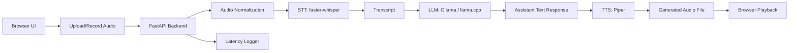

# Design Doc: Naive End-to-End Local-First Voice AI Agent

## 1. Project Overview

Build a minimal end-to-end Voice AI agent that can:

1. Accept a user's spoken input.
2. Convert speech to text using an open-source STT model.
3. Send the transcript to an LLM.
4. Generate a text response.
5. Convert the response back to speech using an open-source TTS engine.
6. Return both the text and audio response to the user.

This first version is intentionally naive. It should prioritize a working full pipeline over real-time streaming, latency optimization, voice cloning, complex orchestration, or production-grade infrastructure.

The goal is to create a clean foundation that can later be extended into a serious Voice AI research/engineering portfolio project.

---

## 2. Target User Experience

The MVP should support the following flow:

1. User opens a simple web UI.
2. User records audio or uploads a `.wav` / `.mp3` file.
3. User clicks "Submit".
4. Backend transcribes the audio.
5. Backend sends transcript to the LLM.
6. Backend synthesizes the LLM response into audio.
7. UI displays:
   - original transcript
   - assistant text response
   - playable assistant audio response
   - basic latency breakdown

This is not a live real-time voice agent yet. It is a turn-based voice assistant.

---

## 3. MVP Scope

### In Scope

- Simple web frontend.
- Audio recording in browser.
- Audio upload to backend.
- Backend endpoint for full pipeline.
- STT using a local or open-source model.
- LLM response using a local model or local OpenAI-compatible server.
- TTS using a local or open-source model.
- Basic latency logging per stage.
- Simple conversation memory for the current session.
- Basic project structure and documentation.

### Out of Scope for MVP

- Real-time streaming STT.
- WebRTC.
- Barge-in/interruption handling.
- Advanced turn-taking.
- Speaker diarization.
- Voice cloning.
- RAG.
- Tool use.
- Multi-user authentication.
- Mobile app.
- Production deployment.
- GPU optimization.
- Distributed serving.
- Advanced eval harness.

---

## 4. Recommended MVP Stack

The implementation should be local-first and cheap.

### Frontend

Use one of:

- React + Vite
- Next.js only if routing/API integration is preferred
- Plain HTML/JS if simplicity is prioritized

Recommended:

```txt
React + Vite + TypeScript
```

Frontend responsibilities:

- Record microphone audio.
- Upload audio file to backend.
- Show transcript.
- Show model response.
- Play returned audio.
- Display timing metrics.

### Backend

Use:

```txt
Python + FastAPI
```

Backend responsibilities:

- Receive uploaded audio.
- Normalize audio format.
- Run STT.
- Call LLM.
- Run TTS.
- Return JSON metadata and audio file URL/base64.

### STT

MVP recommendation:

```txt
faster-whisper
```

Alternative:

```txt
whisper.cpp
```

Use `faster-whisper` first because it is easy to integrate from Python.

Default model:

```txt
Systran/faster-whisper-small.en
```

If the local machine is weak, use:

```txt
Systran/faster-whisper-base.en
```

or

```txt
Systran/faster-whisper-tiny.en
```

### LLM

MVP options:

Option A: Use Ollama locally.

```txt
ollama run llama3.2:3b
```

or

```txt
ollama run qwen2.5:3b
```

Backend calls Ollama's local HTTP API.

Option B: Use llama.cpp server.

This is more inference-engineering-relevant, but slightly more setup.

For the first version, prefer Ollama for implementation speed.

### TTS

MVP recommendation:

```txt
Piper TTS
```

Reason:

- Fast local TTS.
- Easy CLI usage.
- Works well for a minimal local-first project.

Alternative:

```txt
Kokoro TTS
```

Use Kokoro later if you want stronger modern TTS quality.

### Storage

For MVP:

```txt
local filesystem
```

Suggested folders:

```txt
data/uploads/
data/transcripts/
data/tts_outputs/
data/logs/
```

Do not use cloud storage in the first version.

---

## 5. Architecture

### High-Level Flow



### Request Lifecycle

1. Frontend records audio.
2. Frontend sends `multipart/form-data` request to backend.
3. Backend saves raw uploaded audio.
4. Backend converts audio to standard format:
   - mono
   - 16 kHz
   - WAV
5. Backend runs STT.
6. Backend sends transcript to LLM.
7. Backend sends LLM response to TTS.
8. Backend saves generated TTS audio.
9. Backend returns:
   - transcript
   - assistant response
   - audio URL
   - latency metrics

---

## 6. API Design

### `POST /api/voice-turn`

Accepts one audio file and returns one complete assistant turn.

#### Request

Content type:

```txt
multipart/form-data
```

Fields:

```txt
audio_file: File
session_id: string | optional
```

#### Response

```json
{
  "session_id": "string",
  "transcript": "string",
  "assistant_response": "string",
  "audio_url": "string",
  "timing": {
    "audio_save_ms": 0,
    "audio_normalization_ms": 0,
    "stt_ms": 0,
    "llm_ms": 0,
    "tts_ms": 0,
    "total_ms": 0
  },
  "metadata": {
    "stt_model": "Systran/faster-whisper-small.en",
    "llm_model": "llama3.2:3b",
    "tts_engine": "piper",
    "audio_duration_sec": 0
  }
}
```

### `GET /api/audio/{filename}`

Returns generated TTS audio file.

### `GET /api/health`

Returns service status.

```json
{
  "status": "ok",
  "stt_loaded": true,
  "llm_available": true,
  "tts_available": true
}
```

---

## 7. Repository Structure

Use this structure:

```txt
voice-ai-agent/
  README.md
  DESIGN.md
  pyproject.toml
  .env.example
  .gitignore

  backend/
    app/
      main.py
      config.py
      schemas.py

      api/
        routes.py

      services/
        audio_service.py
        stt_service.py
        llm_service.py
        tts_service.py
        session_service.py
        timing_service.py

      utils/
        file_utils.py
        logging_utils.py

    tests/
      test_audio_service.py
      test_stt_service.py
      test_llm_service.py
      test_tts_service.py

  frontend/
    package.json
    vite.config.ts
    src/
      App.tsx
      api.ts
      components/
        Recorder.tsx
        AudioPlayer.tsx
        TimingPanel.tsx
        TranscriptPanel.tsx

  data/
    uploads/
    normalized/
    tts_outputs/
    logs/

  scripts/
    setup_piper.sh
    download_models.sh
    run_backend.sh
    run_frontend.sh
```

---

## 8. Backend Implementation Details

### 8.1 Config

Create `backend/app/config.py`.

Config should support:

```python
STT_MODEL_NAME = "Systran/faster-whisper-small.en"
STT_DEVICE = "cpu"
STT_COMPUTE_TYPE = "int8"

OLLAMA_BASE_URL = "http://localhost:11434"
OLLAMA_MODEL = "llama3.2:3b"

PIPER_BINARY_PATH = "./bin/piper"
PIPER_MODEL_PATH = "./models/piper/en_US-lessac-medium.onnx"

DATA_DIR = "./data"
UPLOAD_DIR = "./data/uploads"
NORMALIZED_DIR = "./data/normalized"
TTS_OUTPUT_DIR = "./data/tts_outputs"
```

Use environment variables where possible, with reasonable defaults.

---

### 8.2 Audio Normalization

Create `audio_service.py`.

Responsibilities:

- Save uploaded file.
- Convert to WAV.
- Resample to 16 kHz.
- Convert to mono.
- Estimate audio duration.

Use `ffmpeg`.

Expected function:

```python
def normalize_audio(input_path: str, output_path: str) -> AudioMetadata:
    ...
```

The function should shell out to ffmpeg:

```bash
ffmpeg -y -i input_file -ac 1 -ar 16000 output.wav
```

Return:

```python
{
  "path": "data/normalized/example.wav",
  "duration_sec": 3.42,
  "sample_rate": 16000,
  "channels": 1
}
```

---

### 8.3 STT Service

Create `stt_service.py`.

Use `faster-whisper`.

Expected interface:

```python
class STTService:
    def __init__(self, model_name: str, device: str, compute_type: str):
        ...

    def transcribe(self, audio_path: str) -> STTResult:
        ...
```

Return:

```python
{
  "text": "what is the weather like today",
  "segments": [
    {
      "start": 0.0,
      "end": 2.3,
      "text": "what is the weather like today"
    }
  ]
}
```

For MVP, only use full final transcript. Do not implement streaming.

---

### 8.4 LLM Service

Create `llm_service.py`.

Use Ollama HTTP API.

Expected interface:

```python
class LLMService:
    def __init__(self, base_url: str, model: str):
        ...

    def generate_response(self, session_id: str, user_text: str) -> str:
        ...
```

Use a simple system prompt:

```txt
You are a helpful, concise voice assistant.
The user is speaking, so respond naturally and briefly.
Avoid markdown unless necessary.
Keep answers under 4 sentences unless the user asks for detail.
```

Call:

```txt
POST http://localhost:11434/api/chat
```

Payload:

```json
{
  "model": "llama3.2:3b",
  "messages": [
    {"role": "system", "content": "..."},
    {"role": "user", "content": "..."}
  ],
  "stream": false
}
```

MVP memory:

Use an in-memory dictionary:

```python
SESSION_MESSAGES: dict[str, list[dict]] = {}
```

For each session, store the last 6 messages.

---

### 8.5 TTS Service

Create `tts_service.py`.

Use Piper CLI.

Expected interface:

```python
class TTSService:
    def __init__(self, piper_binary_path: str, model_path: str):
        ...

    def synthesize(self, text: str, output_path: str) -> TTSResult:
        ...
```

Shell command style:

```bash
echo "Hello world" | piper --model model.onnx --output_file output.wav
```

Important:

- Sanitize text.
- Avoid passing unsafe shell strings directly.
- Prefer `subprocess.run(..., input=text, text=True)`.

Return:

```python
{
  "audio_path": "data/tts_outputs/response.wav",
  "format": "wav"
}
```

---

### 8.6 Timing Service

Create `timing_service.py`.

Implement a simple timing context manager.

Example:

```python
with timer("stt_ms", timing):
    result = stt_service.transcribe(path)
```

The final response should include per-stage latency.

Track:

- audio save latency
- normalization latency
- STT latency
- LLM latency
- TTS latency
- total latency

---

## 9. Frontend Implementation Details

### 9.1 Main UI Components

Create these components:

```txt
Recorder.tsx
TranscriptPanel.tsx
AudioPlayer.tsx
TimingPanel.tsx
```

### 9.2 Recorder

Recorder should:

- Request microphone permission.
- Record audio using `MediaRecorder`.
- Store audio blob.
- Let user preview recorded audio.
- Send audio to backend as `multipart/form-data`.

MVP behavior:

- User clicks "Start Recording".
- User clicks "Stop Recording".
- User clicks "Submit".
- UI waits for response.

Do not implement live streaming yet.

### 9.3 Transcript Panel

Show:

```txt
You said:
{transcript}

Assistant:
{assistant_response}
```

### 9.4 Audio Player

Use native browser audio:

```html
<audio controls src="{audio_url}" />
```

### 9.5 Timing Panel

Show:

```txt
STT: 1234 ms
LLM: 2350 ms
TTS: 850 ms
Total: 4434 ms
```

---

## 10. Development Commands

### Backend

Use `uv` if possible.

```bash
uv venv
source .venv/bin/activate
uv pip install fastapi uvicorn python-multipart faster-whisper requests pydantic
```

Run backend:

```bash
uvicorn backend.app.main:app --reload --port 8000
```

### Frontend

```bash
cd frontend
npm install
npm run dev
```

### Ollama

Install Ollama separately.

Pull model:

```bash
ollama pull llama3.2:3b
```

Run server:

```bash
ollama serve
```

### Piper

Create script:

```bash
scripts/setup_piper.sh
```

The script should:

1. Create `bin/`.
2. Create `models/piper/`.
3. Download Piper binary.
4. Download one English voice model.
5. Test synthesis.

Exact download URLs may vary by platform, so keep this script easy to edit.

---

## 11. Environment Variables

Create `.env.example`.

```bash
STT_MODEL_NAME=Systran/faster-whisper-small.en
STT_DEVICE=cpu
STT_COMPUTE_TYPE=int8

OLLAMA_BASE_URL=http://localhost:11434
OLLAMA_MODEL=llama3.2:3b

PIPER_BINARY_PATH=./bin/piper
PIPER_MODEL_PATH=./models/piper/en_US-lessac-medium.onnx

DATA_DIR=./data
```

---

## 12. Logging

Use structured JSON logs where reasonable.

Log one record per voice turn:

```json
{
  "event": "voice_turn_completed",
  "session_id": "abc",
  "audio_duration_sec": 4.2,
  "transcript_chars": 52,
  "response_chars": 180,
  "stt_ms": 1200,
  "llm_ms": 2600,
  "tts_ms": 900,
  "total_ms": 5000,
  "stt_model": "Systran/faster-whisper-small.en",
  "llm_model": "llama3.2:3b",
  "tts_engine": "piper"
}
```

Save logs to:

```txt
data/logs/voice_turns.jsonl
```

---

## 13. Error Handling

The backend should gracefully handle:

- missing audio file
- unsupported audio format
- ffmpeg failure
- STT failure
- Ollama unavailable
- TTS failure
- empty transcript
- empty LLM response

Return clear JSON errors.

Example:

```json
{
  "error": "llm_unavailable",
  "message": "Could not connect to Ollama at http://localhost:11434"
}
```

---

## 14. MVP Acceptance Criteria

The MVP is complete when:

1. User can record audio from browser.
2. Audio is sent to backend.
3. Backend saves and normalizes the audio.
4. STT returns a transcript.
5. LLM returns a text response.
6. TTS generates a playable audio response.
7. Browser displays transcript, response, and audio player.
8. Browser displays basic latency metrics.
9. One complete local demo can run from README instructions.
10. Project works without paid APIs.

---

## 15. Suggested Implementation Order for Coding Agent

Implement in this order:

1. Create repository structure.
2. Implement FastAPI health endpoint.
3. Implement file upload endpoint that saves audio.
4. Implement audio normalization with ffmpeg.
5. Implement STT service with faster-whisper.
6. Implement Ollama LLM service.
7. Implement Piper TTS service.
8. Connect full `/api/voice-turn` pipeline.
9. Implement simple frontend upload form.
10. Implement browser recorder.
11. Add audio playback.
12. Add latency panel.
13. Add JSONL logging.
14. Add README setup instructions.
15. Add simple tests for services.

Do not optimize before the pipeline works end-to-end.

---

## 16. Testing Plan

### Unit Tests

Test:

- audio file saving
- audio normalization command creation
- STT service returns text for sample audio
- LLM service handles unavailable Ollama
- TTS service writes output file
- timing service records values

### Manual Test Cases

Use these manual tests:

1. Short clear sentence:
   - "Hello, what can you do?"
2. Longer question:
   - "Can you explain what a voice AI agent is in simple terms?"
3. Noisy background sample.
4. Empty or silent audio.
5. Non-English sample, if multilingual support is enabled.
6. Long audio over 30 seconds.

### MVP Metrics

Track:

- audio duration
- STT latency
- LLM latency
- TTS latency
- total latency
- transcript length
- response length

---

## 17. README Requirements

The README should include:

1. Project summary.
2. Architecture diagram.
3. Local setup instructions.
4. How to install ffmpeg.
5. How to install Ollama.
6. How to pull LLM model.
7. How to set up Piper.
8. How to run backend.
9. How to run frontend.
10. Example screenshots.
11. Known limitations.
12. Future roadmap.

---

# Post-MVP Extensions and Advanced Techniques

This section explains what is extendable after the naive end-to-end pipeline works.

## A. Replace Turn-Based Pipeline with Streaming Pipeline

### MVP

The MVP waits for the full user audio before transcription.

### Upgrade

Move toward:

```txt
audio chunks -> VAD -> streaming STT -> partial transcript -> LLM starts earlier -> streaming TTS
```

### Techniques to learn

- streaming STT
- partial hypotheses
- endpointing
- buffering
- incremental decoding
- chunk-level latency measurement

### Why it matters

Real voice agents feel bad if they wait for the full recording, then think, then speak. Streaming reduces perceived latency.

---

## B. Add Voice Activity Detection

### MVP

User manually starts and stops recording.

### Upgrade

Add VAD to detect when speech starts and ends automatically.

Options:

- WebRTC VAD
- Silero VAD

### Techniques to learn

- frame-based audio processing
- speech probability thresholding
- endpointing
- silence timeout
- false-start handling
- noisy environment robustness

### Portfolio value

This shows you understand that voice AI is not just STT + LLM + TTS. Turn detection is a core system component.

---

## C. Add Barge-In and Interruption Handling

### MVP

Assistant speaks until done.

### Upgrade

User can interrupt while assistant is speaking.

Need to implement:

- detect user speech during TTS playback
- stop current audio playback
- cancel current generation if possible
- start a new turn
- preserve conversation state safely

### Techniques to learn

- cancellation tokens
- async task management
- duplex audio
- state machines
- event-driven agent control

---

## D. Add WebRTC

### MVP

HTTP file upload.

### Upgrade

Use WebRTC for real-time browser audio transport.

### Why WebRTC

WebRTC is designed for low-latency audio/video/data communication in browsers.

### Techniques to learn

- peer connection
- media tracks
- signalling server
- audio streams
- jitter buffering
- NAT traversal
- WebRTC data channels

### Suggested path

Do not start with WebRTC. Add it only after the upload-based pipeline works.

---

## E. Replace Simple LLM Call with Agent Orchestration

### MVP

Transcript goes directly to LLM.

### Upgrade

Introduce an agent loop:

```txt
STT -> intent detection -> tool choice -> tool execution -> response planning -> TTS
```

Possible tools:

- calculator
- weather API
- local notes search
- calendar mock API
- browser/search mock
- file search over markdown notes

### Techniques to learn

- function calling
- structured outputs
- tool schemas
- agent state
- retry and validation
- safety checks

---

## F. Add RAG over Personal Notes or Documents

### MVP

LLM answers only from its own parameters.

### Upgrade

Add retrieval over local documents.

Pipeline:

```txt
transcript -> query rewrite -> embedding search -> context selection -> LLM answer -> TTS
```

Components:

- local markdown files
- SQLite or Chroma
- sentence-transformers embeddings
- reranking later

### Advanced topics

- hybrid search
- query rewriting
- chunking strategies
- reranking
- citation generation
- answer faithfulness eval

### Good demo idea

A voice research copilot that answers questions about papers you have saved locally.

---

## G. Add Latency Observatory

### MVP

Return simple timing values.

### Upgrade

Create a dashboard showing:

- STT latency over time
- LLM latency over time
- TTS latency over time
- total turn latency
- audio duration vs latency
- model/backend comparison

### Techniques to learn

- JSONL logs
- SQLite metrics store
- OpenTelemetry
- trace IDs
- p50/p95/p99 latency
- regression tracking

### Portfolio value

This transforms the project from "demo app" into "systems project."

---

## H. Add STT Evaluation

### MVP

Manual transcript inspection.

### Upgrade

Build an evaluation harness.

Use datasets:

- Common Voice subset
- LibriSpeech subset
- FLEURS subset

Metrics:

- WER
- CER
- latency per audio second
- real-time factor

Real-time factor:

```txt
RTF = processing_time_sec / audio_duration_sec
```

If RTF < 1, the system processes faster than real time.

### Compare

- faster-whisper tiny/base/small
- whisper.cpp
- Moonshine
- Distil-Whisper

---

## I. Add TTS Evaluation

### MVP

Manual listening.

### Upgrade

Build a TTS sample gallery.

Track:

- time to first audio
- full synthesis time
- characters per second
- subjective naturalness rating
- pronunciation failures
- stability failures

Compare:

- Piper
- Kokoro
- Coqui / XTTS later

Important:

Do not claim formal MOS unless you actually run a controlled listening study.

---

## J. Add Quantization and Runtime Comparisons

### MVP

Use default CPU models.

### Upgrade

Compare:

STT:
- float32
- int8
- CTranslate2 compute types
- whisper.cpp quantized models

LLM:
- Ollama model variants
- llama.cpp GGUF q4/q5/q8
- context length effect
- prompt length effect
- tokens/sec
- time to first token

TTS:
- model size
- CPU latency
- output quality

### Research value

This connects Voice AI with LLM inference engineering.

---

## K. Add Local OpenAI-Compatible LLM Router

### MVP

Call Ollama directly.

### Upgrade

Create your own router:

```txt
/api/chat -> backend selects provider -> Ollama / llama.cpp / remote API / mock model
```

Track:

- selected backend
- latency
- failure rate
- fallback path

Advanced features:

- route short queries to small model
- route complex queries to stronger model
- fallback on timeout
- cache repeated prompts

---

## L. Add Conversation State Machine

### MVP

Simple list of messages.

### Upgrade

Use explicit states:

```txt
IDLE
LISTENING
TRANSCRIBING
THINKING
SPEAKING
INTERRUPTED
ERROR
```

This is especially important for real-time agents.

### Why it matters

Voice agents are interactive systems. Explicit states make interruptions, errors, and retries easier to reason about.

---

## M. Add Safety and Privacy Controls

### MVP

Local files saved.

### Upgrade

Add:

- delete audio after processing
- user setting for saving/not saving audio
- transcript redaction
- local-only mode
- consent notice
- configurable retention policy

### Why it matters

Voice data is sensitive. Showing privacy awareness strengthens the project.

---

## N. Add Deployment

### MVP

Local only.

### Upgrade Options

Cheap deployment path:

1. Static frontend on GitHub Pages or Cloudflare Pages.
2. Backend local for demo.
3. Optional backend on Oracle Cloud Always Free.
4. Avoid always-on GPU servers.
5. Use local inference for serious demos.

### Important

Do not deploy heavy STT/TTS/LLM inference to a tiny free CPU server unless you accept slow responses.

---

## O. Add Multi-Modal or Meeting Assistant Features

Later extensions:

- YouTube/podcast transcription
- meeting summarization
- speaker diarization
- voice notes app
- paper-reading voice copilot
- interview practice agent
- language pronunciation coach
- customer-support simulation

Best portfolio direction:

Build a "Voice Research Copilot" that can answer questions about your local AI paper notes using speech input and speech output.

---

# Recommended Final Project Identity

The MVP can be named:

```txt
LocalVoiceLab
```

Positioning:

```txt
A local-first Voice AI research playground for studying STT, LLM inference, TTS, latency, and agent orchestration under tight compute budgets.
```

The key is to avoid presenting this as just a chatbot with voice. Present it as an extensible lab for measuring and improving the full voice-agent stack.
